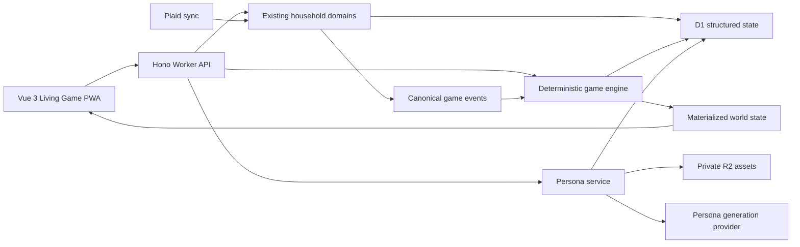

# Homebase Living Game: Technical Product Proposal

**Status:** Proposed architecture
**Author:** Sol Architect
**Date:** 2026-08-15
**Audience:** Product, design, Sol reviewers, Luna implementation agents

## 1. Executive summary

Homebase will pivot from a conventional household-management dashboard into a shared life simulation. Each household member creates a recognizable pixel persona from a selfie or a manual character builder. Real household behavior—reviewing transactions, staying aware of budgets, completing tasks, planning groceries, exercising, learning, and spending time together—changes the personas and the world they inhabit.

The financial and household systems already built remain the authoritative engine. They move behind a game layer rather than being discarded. The primary interface becomes a living household world, three low-friction daily moves, cooperative adventures, and personal progression. Detailed accounting remains available in a secondary Ledger surface.

The pivot has four architectural consequences:

1. Homebase needs private object storage for selfies and generated sprite assets.
2. A deterministic game engine must translate existing product events into moves, progress, rewards, and world state.
3. The frontend must move from a monolithic dashboard to a world-first application shell.
4. Privacy rules must prevent personal financial behavior or health goals from being exposed through another member's character state.

This proposal defines the target product, system boundaries, data model, APIs, safety model, migration sequence, and implementation work packages.

### 1.1 Approved implementation stack

The pivot will use TypeScript end to end with the following target stack:

- **Client:** Vue 3 Single-File Components using the Composition API and `<script setup>`.
- **Client build:** Vite.
- **Routing:** Vue Router.
- **Client state:** Pinia stores, with server state kept behind typed API clients rather than duplicated as permanent client truth.
- **Backend:** Hono running as a Cloudflare Worker.
- **Static delivery:** the compiled Vue SPA and Worker API deployed together with Cloudflare Workers Static Assets.
- **Structured persistence:** Cloudflare D1 with Drizzle schema and migrations.
- **Private assets:** Cloudflare R2.
- **External systems:** Plaid and a provider-independent persona-generation adapter.

The existing React/Vinext application remains the working reference implementation during migration. It will not receive new Living Game UI development and will not be removed until the Vue application reaches verified functional parity.

## 2. Product decision

### 2.1 Product promise

Homebase makes taking care of a shared life feel like caring for a small world together. It automatically handles what it understands, asks each person for no more than a few useful decisions, and turns progress into visible character and world development.

### 2.2 Experience hierarchy

The application has five layers, in order of prominence:

1. **Our World** — the animated home containing household personas.
2. **Today's Moves** — up to three small actions selected for each member.
3. **Adventures** — cooperative weekly and long-term goals.
4. **My Persona** — identity, cosmetics, progress, and preferences.
5. **The Ledger** — detailed financial and household management.

The Ledger is essential, but it is not the home screen.

### 2.3 Product principles

- **Show one useful move, not an inbox.** The system absorbs routine bookkeeping and surfaces exceptions.
- **Reward return, not streak perfection.** Missing days never creates debt, damage, illness, or a backlog.
- **Progress changes the world.** The strongest reward is visible behavior, animation, interaction, and customization.
- **Private data stays private.** Shared characters may communicate broad availability or celebration, never private spending details or sensitive goals.
- **The game is deterministic.** Financial outcomes, task completion, rewards, and move selection must be auditable and testable.
- **AI creates identity assets, not product truth.** Persona generation may be probabilistic; financial classification and rewards are not.
- **The user owns the persona.** Generated appearance is editable, regenerable, and deletable.
- **No punitive embodiment.** Weight, overspending, inactivity, or missed goals never make a character sick, unattractive, ashamed, or smaller.

## 3. Scope

### 3.1 Initial release scope

- Selfie-based or manual pixel persona creation.
- One personal persona per household member.
- A shared animated household world.
- Three daily moves per active member.
- Deterministic completion, progress, and reward events.
- Cooperative weekly adventures.
- Cosmetics and world-item unlocks.
- Game translations for transaction review, connection health, tasks, groceries, workouts, learning, and savings goals.
- A detailed Ledger preserving Mine/Yours/Ours accounting.
- Phone-first PWA behavior and a privacy-filtered apartment display.
- Existing signed-in household membership and partner invitations.

### 3.2 Explicit non-goals for the initial release

- Public social networks, global leaderboards, or competitive household rankings.
- Trading, selling, or purchasing cosmetic items.
- A general-purpose 3D world or real-time multiplayer game engine.
- Facial recognition, identity verification, face embeddings, or biometric authentication.
- Inferring health, ethnicity, gender, personality, or financial status from a selfie.
- Penalizing users for missed habits or budget overages.
- Fully generative world scenes on every request.
- Replacing the deterministic accounting engine with an AI agent.

## 4. Core user journeys

### 4.1 Persona onboarding

1. A signed-in member joins or creates a household.
2. Homebase explains selfie use, deletion behavior, and the manual alternative.
3. The member chooses **Take a selfie**, **Upload a photo**, or **Build manually**.
4. For a selfie, the client presents framing guidance and requires explicit upload consent.
5. Homebase normalizes the image, strips metadata, stores it privately, and starts an asynchronous generation job.
6. The member sees a non-blocking progress state and may continue household setup.
7. Homebase returns a portrait, full-body base sprite, and required animation states.
8. The member edits appearance and approves the persona.
9. The original selfie is deleted by default after the generated persona is approved or after the retention window expires.

The generated persona is not visible to other household members until its owner approves it.

### 4.2 Daily return loop

1. The member opens Homebase into Our World.
2. Their persona draws attention to one recommended move.
3. The member completes, defers, replaces, or opens the move.
4. Completion produces immediate animation and progress.
5. The next move appears until the daily set is complete.
6. Homebase closes the loop with a clear done state; it does not expose an endless queue.

### 4.3 Household interaction

- Tapping one's own persona opens personal moves and progress.
- Tapping another member's persona shows only owner-approved public state and allowed cooperative actions.
- Members can send lightweight encouragement, propose a shared move, or begin a cooperative adventure.
- A member cannot complete another member's private move unless that move is explicitly delegated or shared.

### 4.4 Detailed financial work

The user can enter the Ledger at any time. It retains exact category limits, transaction splits, merchant rules, account health, and Mine/Yours/Ours scopes. Game surfaces deep-link into the exact Ledger action when detail is required.

## 5. Gameplay system

### 5.1 Move taxonomy

Every move belongs to one motivational family:

- **Tend** — finances, transaction review, groceries, and household maintenance.
- **Move** — exercise and physical-wellness goals explicitly configured by the user.
- **Grow** — learning, language practice, and personal-development goals.
- **Connect** — cooperative plans, dates, meals, and shared activities.

These labels are presentation concepts. The source domain remains explicit in the underlying data.

### 5.2 Daily move contract

- Maximum of three active moves per member per local calendar day.
- Moves are generated as a daily snapshot and do not reorder continuously.
- Urgent connection repairs or time-sensitive household actions may replace one move, but never expand the set beyond three.
- A member may replace one move without penalty.
- Deferred moves do not create a growing backlog.
- Minimum Mode lowers effort and may reduce the set to one move.
- Completing zero moves has no negative progression effect.

### 5.3 Candidate selection

Domain adapters produce candidate moves. A deterministic selector ranks candidates using:

- urgency;
- estimated effort;
- ownership and authorization;
- uncertainty requiring human input;
- current household context;
- category diversity;
- recent repetition and cooldown;
- explicit member preferences;
- Minimum Mode;
- privacy visibility.

The selector stores a reason code for every selected move. Suggested scoring for the first implementation:

```text
score = urgency + uncertainty + dueSoon + preferenceBoost
        + cooperativeBoost - effortPenalty - repetitionPenalty
```

The precise weights are configuration, versioned as `move_policy_version`, and covered by fixture tests. An AI model must not choose moves in the initial release.

### 5.4 Completion and progress

A completed real-world action emits one canonical game event. Event processing is idempotent. The event may update:

- personal progression in Tend, Move, Grow, or Connect;
- cooperative household progression;
- an active adventure;
- reward eligibility;
- world animation state;
- persona activity state.

Events only add permanent progression. Temporary visual states may become quiet over time, but earned items and levels never decay.

### 5.5 Rewards

Initial reward classes:

- persona cosmetics;
- expressions and animations;
- room furniture;
- world decorations;
- companion creatures;
- activity props;
- environment themes;
- titles and profile emblems.

Rewards are unlocked through explicit rules. Random rewards may choose among already eligible cosmetic options, but must never affect finances, move priority, or access to functional features.

### 5.6 Recovery behavior

After inactivity, the persona enters a neutral state such as resting, reading, traveling, or enjoying the home. On return:

- stale daily moves are discarded;
- one comeback move is generated with a target duration under two minutes;
- the member receives an immediate reunion animation;
- the system avoids language implying failure, neglect, or lost progress.

## 6. Translating existing Homebase domains

| Existing system | Game representation | Exact detail location |
| --- | --- | --- |
| Transaction review | Sort a delivery | Ledger transaction sheet |
| Merchant rule creation | Unlock an automation helper | Ledger automation settings |
| Fixed category limit | Household provisions or capacity | Ledger budget category |
| Plaid connection issue | Repair a household signal | Ledger connection settings |
| Grocery planning | Stock the kitchen | Grocery list |
| Household task | Tend the home | Home task detail |
| Workout goal | Movement activity or equipment | Goal detail |
| Language goal | Study animation or travel preparation | Goal detail |
| Savings goal | Build a destination or shared object | Ledger goal detail |
| Minimum Mode | Rest mode | Personal settings |

Overspending must be represented as a neutral planning condition, not damage to a persona. Personal spending details remain invisible to other members unless the owner has opted into sharing them.

## 7. Target system architecture

### 7.1 Existing foundation to preserve

- TypeScript domain logic and accounting invariants from the current application.
- D1 with Drizzle schema and migrations.
- Current household authentication and authorization behavior as a migration reference.
- Household membership, invitations, and server-side authorization.
- Plaid token encryption and server-only provider access.
- Accounts, categories, monthly budgets, transactions, splits, and merchant rules.
- Tasks, groceries, goals, goal entries, and Minimum Mode.
- PWA requirements and phone-first delivery.

React components and Vinext route handlers are transitional implementation details, not part of the target stack.

### 7.2 New platform capability

Add one private R2 binding for user uploads and generated persona assets. D1 stores metadata and ownership; R2 stores image bytes. R2 should be provisioned in the dedicated Cloudflare environment only when the first persona-upload workstream begins.

The target application will deploy directly to Cloudflare Workers so it can serve Vue static assets and the Hono API from one versioned deployment. The current Sites deployment remains available during migration but is not the long-term runtime for the Vue application.

### 7.3 Logical boundaries



### 7.4 Proposed source organization

```text
apps/
  living-game/
    index.html
    vite.config.ts
    wrangler.jsonc
    src/
      client/
        main.ts
        App.vue
        router/
        stores/
        composables/
        views/
          WorldView.vue
          TodayView.vue
          AdventuresView.vue
          PersonaView.vue
          LedgerView.vue
          DisplayView.vue
        components/
      worker/
        index.ts
        middleware/
        routes/
packages/
  domain/
    accounting/
    game/
    household/
    personas/
  database/
    schema.ts
    migrations/
    client.ts
  contracts/
    api/
    events/
    sprites/
```

During the transition, the current React/Vinext project remains at the repository root and `apps/living-game` is developed alongside it. Shared packages are introduced only as legacy behavior is extracted and covered by tests. After cutover, the Vue application becomes the repository's primary application and the legacy shell is archived or removed in a dedicated cleanup package.

The existing `app/page.tsx` is a large React client component. It is a visual and behavioral reference, not a component migration target. Luna should reimplement approved flows as focused Vue views and components rather than translate the file line by line. The migration must avoid combining gameplay, image processing, schema changes, and visual redesign in one diff.

### 7.5 Schema ownership cleanup

The current application defines its schema in both `db/schema.ts` and runtime `CREATE TABLE IF NOT EXISTS` statements inside `lib/household.ts`. Before adding game tables, Luna should establish a single migration and schema source of truth. Runtime initialization may validate prerequisites, but it must not continue duplicating the full schema definition.

## 8. Data model

All identifiers are opaque text IDs. Every household-owned table includes `household_id`, even when ownership can be reached through another relation, to simplify authorization and indexed access.

### 8.1 Persona and asset tables

#### `personas`

- `id`
- `household_id`
- `member_id` — unique; one active persona per member
- `display_name`
- `creation_method` — `selfie` or `manual`
- `status` — `draft`, `generating`, `review`, `ready`, `failed`, `deleted`
- `base_style_version`
- `appearance_json` — validated customization values only
- `active_loadout_json`
- `visibility` — `private` or `household`
- `approved_at`
- `created_at`, `updated_at`, `deleted_at`

#### `persona_assets`

- `id`
- `household_id`
- `member_id`
- `persona_id`
- `asset_type` — `source_selfie`, `portrait`, `base_sprite`, `sprite_sheet`, `thumbnail`
- `r2_key`
- `mime_type`
- `byte_size`
- `content_hash`
- `width`, `height`
- `status` — `uploaded`, `processing`, `ready`, `quarantined`, `deleted`
- `retention_expires_at`
- `created_at`, `deleted_at`

R2 keys are never returned directly to the browser. Assets are read through an authorized endpoint or short-lived signed delivery mechanism.

#### `persona_generation_jobs`

- `id`
- `household_id`
- `persona_id`
- `source_asset_id`
- `status` — `queued`, `processing`, `succeeded`, `failed`, `cancelled`
- `provider`
- `provider_job_id`
- `prompt_version`
- `idempotency_key` — unique
- `attempt_count`
- `error_code`, `error_message_safe`
- `started_at`, `completed_at`, `created_at`

#### `cosmetic_catalog`

- `id`
- `kind`
- `name`
- `asset_manifest_json`
- `eligibility_rule_json`
- `catalog_version`
- `active`

#### `persona_unlocks`

- `id`
- `household_id`
- `member_id`
- `persona_id`
- `cosmetic_id`
- `source_event_id`
- `unlocked_at`

Unique constraint: `(persona_id, cosmetic_id)`.

### 8.2 Game tables

#### `daily_moves`

- `id`
- `household_id`
- `member_id`
- `local_date`
- `slot` — 1 through 3
- `family` — `tend`, `move`, `grow`, `connect`
- `source_type`, `source_id`
- `title`, `short_label`
- `estimated_seconds`
- `status` — `active`, `complete`, `deferred`, `replaced`, `expired`
- `selection_reason_code`
- `move_policy_version`
- `completed_at`, `created_at`

Unique constraint: `(member_id, local_date, slot)`.

#### `game_events`

- `id`
- `household_id`
- `member_id` — nullable for household events
- `event_type`
- `source_type`, `source_id`
- `visibility` — `private`, `household`, `display`
- `payload_json` — versioned and validated
- `idempotency_key` — unique
- `occurred_at`, `created_at`

#### `progress_balances`

- `id`
- `household_id`
- `member_id` — nullable for household balance
- `dimension` — `tend`, `move`, `grow`, `connect`, `household`
- `lifetime_points`
- `level`
- `updated_at`

Unique constraint: `(household_id, member_id, dimension)`.

#### `adventures`

- `id`
- `household_id`
- `template_key`
- `title`
- `status` — `offered`, `active`, `complete`, `expired`, `dismissed`
- `target_value`, `current_value`
- `starts_at`, `ends_at`, `completed_at`
- `visibility`

#### `world_state`

- `household_id` — primary key
- `world_version`
- `scene_key`
- `state_json` — validated materialized presentation state
- `updated_at`

`world_state` is a cache derived from canonical events and unlocks. It is not the source of financial, goal, or task truth.

### 8.3 Indexes required by known queries

- Persona by member and household.
- Ready assets by persona and type.
- Generation jobs by status and creation time.
- Daily moves by member/date/status.
- Game events by household/occurred time and member/visibility/time.
- Adventures by household/status/end time.
- Unlocks by persona/unlock time.

Generate and inspect the D1 migration and run `PRAGMA optimize` after adding the indexes.

## 9. Persona generation pipeline

### 9.1 Required output contract

The generation provider must return a versioned asset manifest containing:

- square profile portrait;
- full-body neutral pose;
- idle animation;
- four-direction walking animation or an approved two-direction MVP subset;
- celebration animation;
- resting animation;
- transparent background;
- fixed pixel dimensions and grid alignment;
- bounded color palette;
- attachment anchors for hair, clothing, accessories, and props.

The first release should standardize on one base sprite resolution and upscale with nearest-neighbor rendering.

### 9.2 Provider abstraction

Use a `PersonaGenerator` interface rather than embedding one vendor into API routes:

```ts
interface PersonaGenerator {
  createJob(input: PersonaGenerationInput): Promise<GenerationJobRef>;
  getJob(ref: GenerationJobRef): Promise<GenerationJobResult>;
  cancelJob?(ref: GenerationJobRef): Promise<void>;
}
```

Provider selection is an architecture decision record to complete before implementation. The provider must support commercial use, deletion requests, acceptable data-retention terms, and server-to-server operation from the deployed runtime.

### 9.3 Processing sequence

1. Authenticate and authorize the member.
2. Validate image size, content type, and decoded dimensions.
3. Remove EXIF and other metadata.
4. Normalize orientation, crop, and color space.
5. Store the normalized source under a random private R2 key.
6. Create an idempotent generation job.
7. Submit the normalized source and versioned generation specification.
8. Validate returned dimensions, transparency, file type, and manifest completeness.
9. Store derived assets under new private R2 keys.
10. Move the persona to `review`.
11. After approval, mark it `ready` and schedule source-selfie deletion.
12. Record deletion completion; never rely only on a UI flag.

Generation is asynchronous. The browser polls a status endpoint with bounded backoff for the MVP; a future push event may replace polling.

### 9.4 Manual fallback

Manual creation must use the same `appearance_json`, asset manifest, loadout, and rendering system. The rest of the game must not care whether the character began with a selfie.

## 10. API proposal

### 10.1 Persona endpoints

- `POST /api/personas` — create a draft persona.
- `POST /api/personas/:id/selfie` — validate and upload a source image.
- `POST /api/personas/:id/generation` — start an idempotent generation job.
- `GET /api/personas/:id/generation` — read safe job status.
- `PATCH /api/personas/:id` — edit appearance, loadout, name, or visibility.
- `POST /api/personas/:id/approve` — approve generated assets.
- `POST /api/personas/:id/regenerate` — create a bounded replacement job.
- `DELETE /api/personas/:id/source-selfie` — delete the source immediately.
- `DELETE /api/personas/:id` — soft-delete metadata and enqueue asset deletion.
- `GET /api/persona-assets/:assetId` — authorized asset delivery.

### 10.2 Game endpoints

- `GET /api/world` — privacy-filtered world snapshot for the current member.
- `GET /api/game/moves?date=YYYY-MM-DD` — get or materialize today's move snapshot.
- `POST /api/game/moves/:id/complete` — complete idempotently.
- `POST /api/game/moves/:id/defer` — defer without penalty.
- `POST /api/game/moves/:id/replace` — replace within policy.
- `GET /api/game/progress` — current member and allowed household progress.
- `GET /api/game/adventures` — offered and active adventures.
- `POST /api/game/adventures/:id/accept` — activate an offer.
- `GET /api/game/rewards` — unlocked and equipped cosmetics.

### 10.3 Display endpoint

- `GET /api/display/world` — display-safe scene containing approved personas, broad world state, and no raw financial or private goal details.

A later milestone may introduce a revocable display token. Until then, the private display runs in an authenticated household session.

### 10.4 Response rules

- All mutations return the new authoritative state required to update the immediate UI.
- Every mutation accepts or derives an idempotency key.
- Client-provided household IDs, member IDs, point values, reward IDs, or completion values are never trusted.
- APIs return stable machine-readable error codes and short safe user messages.

## 11. Authorization and privacy

### 11.1 Authorization matrix

| Resource | Owner | Household member | Apartment display |
| --- | --- | --- | --- |
| Source selfie | Read/delete | No access | No access |
| Draft persona | Read/write | No access | No access |
| Approved persona | Read/write | Read if shared | Read if display-approved |
| Personal moves | Read/write | No access by default | No access |
| Cooperative moves | Read/write | Read/participate | Summary only |
| Personal financial detail | Existing visibility rules | Only if owner shared | Never |
| World state | Full allowed view | Full allowed view | Filtered view |

Every check is enforced server-side after resolving the authenticated member. Hiding a control in Vue is not authorization.

### 11.2 Selfie handling

- Obtain explicit consent immediately before upload.
- Allow manual persona creation without degraded game access.
- Accept a narrow allowlist of image formats and enforce a size limit.
- Strip metadata before durable storage.
- Keep source and derived assets private.
- Delete source selfies by default after approval and no later than the documented retention deadline.
- Provide immediate source deletion and complete persona deletion controls.
- Do not log image bytes, signed asset URLs, or provider payloads.
- Do not compute or retain face embeddings.
- Do not reuse selfies for model training, identity verification, advertising, or analytics.

### 11.3 Inferred-state privacy

Persona animations can leak information even when numbers are hidden. The world composer must use a visibility-filtered event stream. Examples:

- A private overspending condition cannot make another member's visible world state look distressed.
- A private health goal cannot produce a household-visible inactivity signal.
- The display may celebrate a member only when the underlying event is `display` visible.
- Cooperative events may be visible to all participating household members.

## 12. Frontend proposal

The client uses Vue 3 Single-File Components with TypeScript, the Composition API, and `<script setup>`. Vue Router owns navigation. Pinia stores own session-level UI and world interaction state; D1-backed records remain authoritative on the server and are refreshed through typed API clients.

### 12.1 Navigation

Primary phone navigation:

- World
- Today
- Adventures
- Persona

The Ledger is opened through a distinct utility entry and deep links from relevant moves. It should not occupy the center of the primary navigation.

### 12.2 World rendering

Use DOM/CSS and sprite-sheet animation for the initial release. Avoid introducing a full canvas game engine until profiling demonstrates that the required scene cannot meet performance targets.

World composition consists of:

- one responsive scene container;
- deterministic zones and anchor points;
- persona sprite components;
- furniture and prop layers;
- short state-driven animation sequences;
- reduced-motion fallbacks;
- tap targets rendered separately from decorative pixels.

Recommended Vue boundaries:

- `WorldScene.vue` composes the current privacy-filtered scene.
- `PersonaSprite.vue` renders one manifest and animation state.
- `DailyMoveCard.vue` owns one action affordance but not completion truth.
- `useWorld()` coordinates world reads and refreshes.
- `useDailyMoves()` coordinates move actions and optimistic visual feedback.
- Pinia stores must remain small and domain-focused; a single global application store is prohibited.

### 12.3 Accessibility

- Every sprite interaction has a semantic button or link.
- The world has a structured text equivalent listing characters, current actions, and available moves.
- Never encode progress through color or animation alone.
- Support `prefers-reduced-motion` by replacing loops with still poses and brief fades.
- Maintain at least 44-by-44 CSS-pixel touch targets regardless of sprite resolution.
- Allow users to rename personas and provide alt descriptions.
- Selfie framing guidance must be available as text and not require visual alignment alone.

### 12.4 PWA and offline behavior

- Cache approved derived sprite assets and static world art only after authorization.
- Never cache source selfies, raw bank data, Plaid responses, or authenticated financial API responses in the service worker.
- The last privacy-filtered world snapshot may be available offline on the member's device.
- Offline completion may be supported later for nonfinancial moves with idempotent reconciliation.
- Transaction review and other financial writes remain online-only initially.

The Vue build uses a generated service worker or a deliberately maintained Worker-compatible service worker. The implementation must document cache categories and must not adopt a broad cache-first rule for authenticated API routes.

## 13. Event architecture

### 13.1 Canonical event examples

- `transaction.reviewed`
- `merchant_rule.created`
- `bank_connection.repaired`
- `task.completed`
- `grocery_item.checked`
- `goal_entry.recorded`
- `daily_move.completed`
- `adventure.completed`
- `persona.approved`
- `persona.cosmetic_equipped`

Domain writes and their game events should be committed atomically where D1 permits batching. If an event is derived after an existing domain write, it must use a deterministic idempotency key such as `<event-type>:<source-id>:<version>`.

### 13.2 Processing model

The first release may process game events synchronously after a successful domain mutation because the workload is small and the reward rules are deterministic. Persona generation remains asynchronous. If event volume or external integrations later require a queue, the `game_events` table already provides a replayable boundary.

### 13.3 World materialization

The world composer reads:

- approved persona manifests and loadouts;
- unlocked world items;
- active adventures;
- recent visibility-filtered events;
- household progress;
- explicit quiet/rest mode settings.

It writes a versioned `world_state` projection. Projection rebuilds must be deterministic from canonical records.

## 14. Financial integrity

The game layer cannot alter accounting semantics. Existing invariants remain mandatory:

1. Account ownership and transaction spending scope remain separate.
2. Transaction splits equal the imported amount exactly.
3. Transfers and credit-card payments do not count as spending.
4. Refunds reduce the original scope and category.
5. Category limits do not move without explicit user action.
6. Personal detail visibility is owner-controlled.
7. High-confidence imports avoid human review; uncertain records create moves.

Game points are never currency, never redeemable, and never included in financial calculations.

## 15. Observability and operations

### 15.1 Required telemetry

- Persona generation success rate and duration.
- Generation failure codes without image content.
- Source-selfie deletion completion and overdue deletion count.
- Daily move generation latency and candidate counts.
- Move completion, replacement, and deferral rates.
- Comeback-loop completion without identifying private source data.
- World endpoint latency and sprite-asset cache behavior.
- Plaid connection health and sync freshness through existing safe metrics.

### 15.2 Audit requirements

Record security-relevant actions:

- selfie uploaded, approved, deleted, or expired;
- persona visibility changed;
- household member viewed or modified a shared persona;
- display access created or revoked;
- generation provider job created or cancelled.

Audit records contain IDs and safe action metadata, not images or financial details.

### 15.3 Failure behavior

- Persona-generation failure falls back to retry or manual creation; it does not block access to Homebase.
- Missing sprite assets show a neutral customizable placeholder.
- Game-engine failure does not block Ledger access or existing domain writes.
- World-state projection failure falls back to the last valid projection.
- Plaid outages produce one repair move and a connection state, not repeated notifications.

## 16. Testing strategy

### 16.1 Unit tests

- Candidate scoring and top-three selection fixtures.
- Minimum Mode and comeback behavior.
- Event idempotency and progress calculations.
- Reward eligibility and no-decay guarantees.
- Visibility filtering for personal, household, and display contexts.
- Persona manifest validation.
- Asset ownership and retention calculations.
- Existing accounting invariants.

### 16.2 Integration tests

- Persona draft → upload → generation → review → approval → source deletion.
- Manual persona creation using the same ready-state contract.
- Domain mutation → game event → progress → world projection.
- Transaction review move deep-link and completion.
- Partner visibility and Mine/Yours reversal.
- Unauthorized selfie, move, and asset access.
- Duplicate completion and generation requests.
- Expired generation jobs and retries.

### 16.3 Product tests

- A new member can reach a usable world without uploading a selfie.
- A returning member can complete today's first move in under 20 seconds.
- No more than three moves appear.
- Missing several days produces no backlog or negative language.
- The apartment display reveals no raw transaction, account, or private-goal data.
- Reduced-motion users can use every feature.

### 16.4 Performance targets

- First usable world UI within 2.5 seconds on a modern mobile connection after cached app shell load.
- Interaction response under 100 milliseconds for local visual feedback.
- Non-generation API p95 under 500 milliseconds under expected household load.
- Approved persona asset bundle kept small enough for phone and display caching; set the exact budget after the first sprite prototype.

## 17. Migration and rollout

### Phase 0 — Parallel Vue/Hono foundation

- Create `apps/living-game` without changing the current production application.
- Configure Vue 3, Vite, Vue Router, Pinia, Hono, and Cloudflare Worker static-asset delivery.
- Add World, Today, Adventures, Persona, Ledger, and Display route placeholders.
- Add a typed `/api/health` boundary and shared response contract.
- Establish Vue unit testing, Worker route testing, linting, and type checking.
- Document local development and preserve the current React commands.

**Exit condition:** The Vue application and Hono API build and test independently while the existing React/Vinext application remains unchanged and operational.

### Phase 1 — Domain foundation and contracts

- Consolidate schema ownership and database helpers.
- Extract authentication/authorization helpers from the broad household module.
- Extract framework-independent TypeScript domain services without changing existing behavior.
- Define game-event, move, persona-manifest, and world-state contracts.
- Add feature flags at household/member level.

**Exit condition:** Existing tests pass and existing Homebase behavior is unchanged.

### Phase 2 — Game shell with temporary personas

- Replace the placeholder Vue views with the approved World, Today, Adventures, Persona, and Ledger navigation model.
- Use temporary hand-authored placeholder sprites.
- Implement accessible sprite rendering and reduced motion.
- Reimplement current financial flows in Ledger against migrated Hono APIs without changing accounting behavior.

**Exit condition:** Users can navigate the new hierarchy and all existing functionality remains reachable.

### Phase 3 — Deterministic daily moves

- Add game tables and migrations.
- Implement candidate adapters for transactions, connection health, tasks, groceries, and goals.
- Implement top-three selection, completion, deferral, replacement, Minimum Mode, and comeback behavior.
- Add event idempotency and progress balances.

**Exit condition:** Daily moves are stable, auditable, limited to three, and backed by real domain actions.

### Phase 4 — Persona creation and private assets

- Enable R2 and create asset metadata tables.
- Implement manual character creation first.
- Implement selfie consent, upload, normalization, generation adapter, review, approval, regeneration, and deletion.
- Add one approved generation provider after legal/privacy review.

**Exit condition:** A member can safely create, approve, edit, and delete a persona without blocking the household app.

### Phase 5 — Progression, rewards, and world behavior

- Implement reward rules and catalog.
- Add persona loadouts and world decorations.
- Materialize privacy-filtered world state.
- Add cooperative adventures and character interactions.

**Exit condition:** Real actions produce immediate, persistent, non-punitive world changes.

### Phase 6 — Apartment display and voice

- Add a dedicated display-safe route and projection.
- Add revocable display pairing if supported by the hosting/auth model.
- Add shareable Siri Shortcuts and concise voice responses.
- Treat Alexa as a separate integration decision rather than coupling it to Siri work.

**Exit condition:** The apartment display is useful at a glance and cannot expose private details.

### Phase 7 — Runtime cutover and beta hardening

- Provision the dedicated Cloudflare Worker, D1, R2, secrets, and custom-domain environment.
- Select and integrate the public account authentication model before opening registration.
- Migrate household data with record counts and accounting reconciliation.
- Run privacy and authorization review.
- Add retention monitoring and deletion repair jobs.
- Tune move-selection policy using aggregate outcomes.
- Profile animation, asset delivery, and mobile performance.
- Cut traffic over only after parity, migration, rollback, and smoke checks pass.
- Remove legacy dashboard entry points in a later cleanup after the rollback window closes.

## 18. Luna-ready work packages

Each package should be assigned separately. Sol reviews every diff before the next dependent package begins.

### LG-000: Parallel Vue/Hono foundation

**Goal:** Establish the target application stack alongside the existing React/Vinext application.
**Dependencies:** None.
**Deliverables:** `apps/living-game` with Vue 3, Vite, Vue Router, Pinia, Hono, Cloudflare Worker configuration, route placeholders, typed health endpoint, test setup, and development documentation.
**Acceptance criteria:** The Vue application builds and type-checks; the Worker health route has a focused test; all six approved client routes render distinct accessible headings; the existing root application files, scripts, build, and production deployment configuration remain untouched; no D1, R2, Plaid, authentication, or game-domain integration is added; nothing is deployed.

### LG-001: Schema ownership consolidation

**Goal:** Remove duplicated schema definitions and establish one safe migration path.
**Dependencies:** LG-000.
**Deliverables:** Database bootstrap refactor, preserved D1 behavior, updated tests, architecture note.
**Acceptance criteria:** No product behavior change; existing data remains readable; build, lint, and tests pass; runtime does not maintain a second full handwritten schema.

### LG-002: Domain and authorization extraction

**Goal:** Split authentication, household authorization, and domain queries out of `lib/household.ts`.
**Dependencies:** LG-001.
**Deliverables:** Small typed services with no UI redesign.
**Acceptance criteria:** Every existing API remains household-scoped; local development fallback remains isolated; tests cover cross-household denial.

### LG-003: Game contracts

**Goal:** Define versioned TypeScript contracts for moves, events, persona manifests, progress, and world projections.
**Dependencies:** LG-002.
**Deliverables:** Framework-independent TypeScript types, validators, fixtures, and contract tests in shared packages.
**Acceptance criteria:** Invalid visibility, sprite manifests, payload versions, and move states are rejected.

### LG-004: World-first application shell

**Goal:** Replace Vue route placeholders with the new navigation and world using temporary sprites.
**Dependencies:** LG-000, LG-003.
**Deliverables:** Vue World, Today, Adventures, Persona, Ledger, and display views; responsive navigation; Pinia store boundaries; reduced-motion behavior.
**Acceptance criteria:** Existing functionality remains reachable; world is the default route; keyboard and screen-reader navigation works.

### LG-005: Daily move schema and selector

**Goal:** Implement deterministic top-three move materialization.
**Dependencies:** LG-001, LG-003.
**Deliverables:** Migration, candidate interface, selector, policy version, fixtures, and read endpoint.
**Acceptance criteria:** At most three stable moves per member/day; privacy and ownership enforced; deterministic fixture outputs.

### LG-006: Domain move adapters

**Goal:** Produce move candidates from current Homebase data.
**Dependencies:** LG-005.
**Deliverables:** Transaction, connection-health, task, grocery, and goal adapters.
**Acceptance criteria:** High-confidence automated records do not produce moves; uncertain or actionable records do; no private move leaks.

### LG-007: Completion and game events

**Goal:** Connect move completion to real domain mutations and idempotent game events.
**Dependencies:** LG-006.
**Deliverables:** Completion/deferral/replacement endpoints, event processor, progress balances, tests.
**Acceptance criteria:** Duplicate requests do not duplicate progress; domain failures do not award progress; zero-completion days do not reduce progress.

### LG-008: Manual persona MVP

**Goal:** Deliver persona creation without selfie or external generation dependencies.
**Dependencies:** LG-003, LG-004.
**Deliverables:** Persona schema, appearance editor, starter sprite parts, approval and loadout flow.
**Acceptance criteria:** Manual personas satisfy the final manifest contract and are fully usable in World.

### LG-009: Private asset storage

**Goal:** Add authorized R2 asset storage and retention metadata.
**Dependencies:** LG-001, provider-independent decision to enable R2.
**Deliverables:** Binding, schema, upload validation, metadata stripping, authorized retrieval, deletion path, tests.
**Acceptance criteria:** Cross-member source access fails; R2 keys are not exposed; disallowed files are rejected; deletion is auditable.

### LG-010: Selfie persona generation

**Goal:** Generate a reviewable persona from a selfie.
**Dependencies:** LG-008, LG-009, provider ADR.
**Deliverables:** Provider adapter, job lifecycle, polling, asset validation, review, regeneration, safe errors.
**Acceptance criteria:** Generation is idempotent; failure falls back gracefully; source deletion policy is enforced; no provider secret reaches the client.

### LG-011: Rewards and world projection

**Goal:** Translate events into unlocks and deterministic world state.
**Dependencies:** LG-007, LG-008.
**Deliverables:** Reward rules, catalog, unlocks, loadouts, world composer, privacy filtering.
**Acceptance criteria:** Unlocks never decay; rebuilding produces the same state; display/private projections differ correctly.

### LG-012: Cooperative adventures

**Goal:** Add weekly shared challenges without punitive deadlines.
**Dependencies:** LG-007, LG-011.
**Deliverables:** Templates, offers, acceptance, contribution events, completion rewards.
**Acceptance criteria:** Participation is explicit; expiration has no penalty; private events contribute only when allowed.

### LG-013: Display-safe world

**Goal:** Turn the apartment display into an ambient shared world.
**Dependencies:** LG-011.
**Deliverables:** Display projection and route, idle behavior, large-screen layout, privacy tests.
**Acceptance criteria:** No raw financial or private-goal data; touch/phone controls remain separate; reduced motion supported.

### LG-014: Voice actions

**Goal:** Expose a minimal action vocabulary through shareable Siri Shortcuts.
**Dependencies:** LG-007.
**Deliverables:** Authenticated deep links or supported action endpoints, concise responses, setup instructions.
**Acceptance criteria:** Voice cannot bypass authorization; ambiguous commands request confirmation; financial detail is minimized in spoken output.

### LG-015: Dedicated runtime and production cutover

**Goal:** Move the verified Vue/Hono application to its owned Cloudflare runtime and custom domain without losing household data.
**Dependencies:** LG-002 through LG-014 as required for the approved beta scope; authentication ADR; migration runbook.
**Deliverables:** Worker static-assets deployment, D1/R2 bindings, secrets, authentication integration, data migration, custom-domain configuration, rollback plan, reconciliation report, and post-cutover smoke checks.
**Acceptance criteria:** Record counts and financial totals reconcile; Plaid connections remain encrypted and healthy or have an explicit relink plan; both household members can sign in; private assets remain private; rollback is tested; the legacy deployment remains available during the rollback window.

## 19. Sol review gates

Sol must review each Luna implementation for:

1. adherence to this proposal and the assigned package boundary;
2. preservation of accounting invariants;
3. server-side authorization and privacy filtering;
4. idempotency of mutations and event processing;
5. migration safety and rollback implications;
6. accessibility and reduced-motion behavior;
7. tests matching acceptance criteria;
8. absence of unrelated redesign or speculative abstractions.

No package that handles source selfies, generation providers, or asset deletion should deploy without a specific privacy review.

## 20. Decisions required before dependent work

The following decisions do not block LG-000 through LG-008:

1. **Persona-generation provider:** commercial rights, runtime compatibility, pricing, retention, deletion, and output consistency.
2. **Source-selfie retention:** recommended default is deletion immediately after approval, with an automatic maximum retention window for abandoned jobs.
3. **Sprite specification:** base resolution, animation frame counts, directions, and attachment anchors.
4. **Progress terminology:** whether the user sees points, levels, named stages, or only visual evolution.
5. **Persona visibility default:** recommended default is private until approval, then household-visible by explicit confirmation.
6. **Application authentication:** private beta identity and the future public account provider. This must be decided before production cutover, not before the local Vue foundation.
7. **Display authentication:** authenticated browser session for the first release versus revocable paired-display token.
8. **Voice priority:** Siri Shortcuts first is recommended because both initial members use iPhones.

## 21. Definition of pivot completion

The pivot is complete when:

- the default experience is the household world, not a financial dashboard;
- every household member can create and control a recognizable pixel persona;
- daily upkeep is expressed through at most three useful moves;
- real Homebase actions produce immediate character or world feedback;
- detailed financial accounting remains accurate and accessible in the Ledger;
- returning after inactivity feels welcoming and produces no backlog;
- personal financial, goal, and selfie data remain protected across household and display contexts;
- the old dashboard can be removed without losing functional capability.

## 22. Standard Luna handoff format

Sol should use the following block when assigning an implementation package:

```text
LUNA HANDOFF — <package ID and title>

Objective:
<one bounded implementation outcome>

Read first:
- docs/LIVING_GAME_TECHNICAL_PROPOSAL.md
- <specific current files>

In scope:
- <required work>

Out of scope:
- <explicit exclusions>

Constraints:
- Preserve existing user changes and unrelated behavior.
- Use server-side household authorization for every read and write.
- Use apply_patch for edits.
- Do not commit, push, deploy, or message the user.

Acceptance criteria:
- <package criteria>

Validation:
- <commands and focused tests>

Return to Sol:
- Summary of changes
- Files changed
- Validation results
- Risks, assumptions, and follow-up work
```

This document is the governing proposal for the pivot until superseded by a reviewed architecture decision record or an updated proposal.
